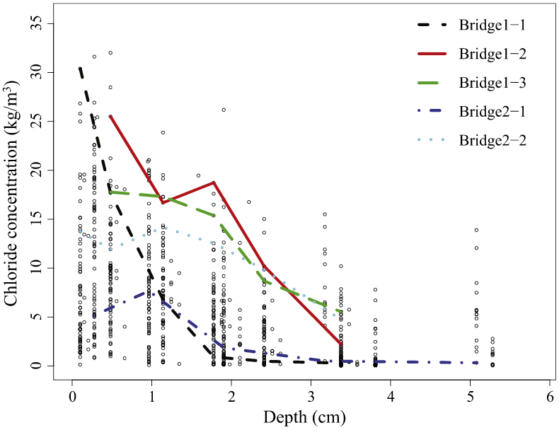

# CorrosionRisk_RESS2018
## About
This is a demo to demonstrate the work of aging infrastructure corrosion risk assessment, from one of the research projects listed in [Suiyao Chen's Homepage](https://sites.google.com/mail.usf.edu/suiyaochen-professional/publication?authuser=0). The related paper is "A Data Heterogeneity Modeling and Quantification Approach for Field Pre-assessment of Chloride-induced Corrosion in Aging Infrastructures". The related presentation slides are "A Data-driven Heterogeneity Quantification Approach for Chloride Ingress Profiles of Aging Marine Infrastructures".

The paper [A Data Heterogeneity Modeling and Quantification Approach for Field Pre-assessment of Chloride-induced Corrosion in Aging Infrastructures](https://www.researchgate.net/publication/321287896_A_Data_Heterogeneity_Modeling_and_Quantification_Approach_for_Field_Pre-assessment_of_Chloride-induced_Corrosion_in_Aging_Infrastructures) has been published in [Reliability Engineering & System Safety](https://www.sciencedirect.com/science/article/pii/S095183201630847X). To cite this paper, please use 
> Suiyao Chen⁠, Lu Lu⁠, Yisha Xiang⁠, Qing Lu⁠, Mingyang Li⁠, "A Data Heterogeneity Modeling and Quantification Approach for Field Pre-assessment of Chloride-induced Corrosion in Aging Infrastructures", Reliability Engineering and System Safety, Vol. 171, pp. 123–135, March 2018. https://doi.org/10.1016/j.ress.2017.11.013

## Instructions

- **Demo.R** contrains the functions to load and process data. The **CorrosionData.csv** in the **Data** folder is from the **report**. 
- **Plot.R** is used to generate the visualizaiton plots for the corrosion data and the modeling results. 

#### The plots are shown as below:

